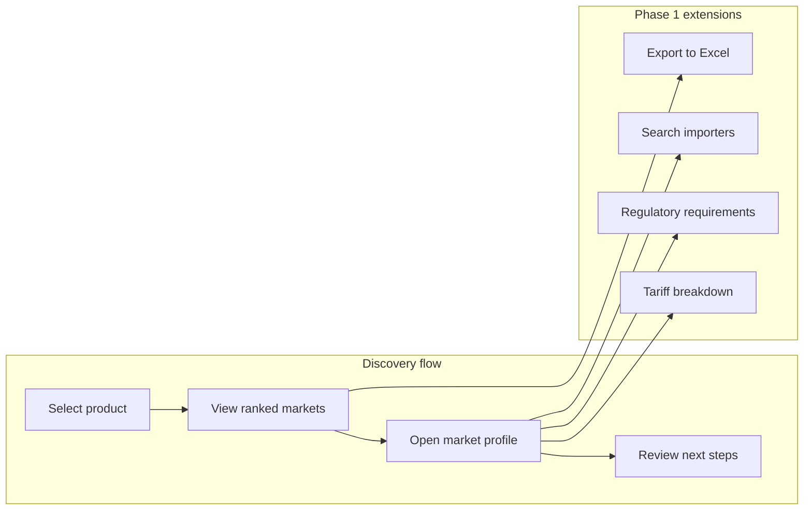

# Market Intelligence Tool — Functional Specification

| Field                 | Value                                            |
| --------------------- | ------------------------------------------------ |
| **Version**           | 0.1 (draft)                                      |
| **Status**            | Draft — for internal review and ACCI co-design   |
| **Date**              | 2026-07-01                                       |
| **Authors**           | ICPSD Crisis Resilience team                     |
| **Parent document**   | [SCOPING_NOTE.md](../../SCOPING_NOTE.md)         |
| **Related documents** | [DATA_SPECIFICATION.md](./DATA_SPECIFICATION.md) |

---

## 1. Purpose

This Functional Specification (FSD) translates the product vision in the scoping note into testable functional requirements. It defines **what** the Market Intelligence Tool must do for each user persona, organised by delivery phase.

This document is the basis for:

- Co-design workshops with ACCI and the MSME Support Centre
- Frontend and backend implementation
- Acceptance testing at pilot handover

**Out of scope for this document:** scoring formulas (see future Scoring Methodology doc), infrastructure runbooks, and detailed API schema (auto-generated from FastAPI OpenAPI at `/docs`).

---

## 2. Product summary

The Market Intelligence Tool is a data-driven trade dashboard for Afghan MSMEs, exporters, chambers of commerce, and development partners. Users select an Afghan export product and receive evidence-based market intelligence — ranked destination markets, trade indicators, tariff context, competitor profiles, and practical next steps — to inform export strategy and market diversification.

**Geographic scope:** Afghanistan as country of origin; global destination markets.

**Product scope (pilot):** 34 Afghan export products across tree nuts, spices, dried/fresh fruits, carpets, luxury fibres, minerals, and oilseeds (see `config.py`).

**Delivery phases** (from scoping note):

| Phase | Label        | Scope                                                                                |
| ----- | ------------ | ------------------------------------------------------------------------------------ |
| 1     | Core         | Composite score, tariff breakdown, importers directory, Excel export, regulatory hub |
| 2     | Intermediate | HS code AI, route planner, demand/competition analyzer, trade facilitation centre    |
| 3     | Advanced     | Pricing estimator, industry intelligence                                             |

---

## 3. Personas

### 3.1 Afghan MSME exporter (primary)

| Attribute             | Description                                                                        |
| --------------------- | ---------------------------------------------------------------------------------- |
| **Role**              | Producer, processor, or trader ready to export or expand exports                   |
| **Goal**              | Identify which destination market offers the best reward-to-risk for their product |
| **Technical context** | Mobile phone or shared PC; variable bandwidth; may prefer Dari or Pashto           |
| **Key question**      | *"Which market should I target for my product, and what do I need to do next?"*    |

### 3.2 Trade Information Officer (TIO) at ACCI / chambers

| Attribute             | Description                                                                                   |
| --------------------- | --------------------------------------------------------------------------------------------- |
| **Role**              | Staff who advise member businesses on export opportunities                                    |
| **Goal**              | Monitor trade trends, generate market briefs, guide MSMEs through export steps                |
| **Technical context** | Desktop at office; moderate bandwidth; English and local languages                            |
| **Key question**      | *"What is the current trade picture for this product, and what should I tell this exporter?"* |

### 3.3 International buyer / investor

| Attribute             | Description                                                                      |
| --------------------- | -------------------------------------------------------------------------------- |
| **Role**              | Foreign importer or investor sourcing Afghan products                            |
| **Goal**              | Assess Afghan export potential, supplier landscape, and market access conditions |
| **Technical context** | Desktop; good bandwidth; English                                                 |
| **Key question**      | *"What does Afghanistan export in this category, and where is it competitive?"*  |

### 3.4 Development partner / donor

| Attribute             | Description                                                                          |
| --------------------- | ------------------------------------------------------------------------------------ |
| **Role**              | UNDP, ITC, World Bank staff monitoring trade performance                             |
| **Goal**              | Target technical assistance, monitor programme impact, support evidence-based policy |
| **Technical context** | Desktop; good bandwidth; English                                                     |
| **Key question**      | *"Where are the largest untapped export opportunities for Afghan products?"*         |

---

## 4. User journeys (high level)

**Primary journey (implemented):**

1. User lands on product catalogue (`/`)
2. User searches or filters by category, selects a product
3. User views ranked markets by Opportunity Score (`/discover/{hs_code}`)
4. User opens a market profile with score breakdown, trade data, competitors, and next steps (`/discover/{hs_code}/markets/{market_code}`)

---

## 5. Phase 1 features

### 5.1 Composite Opportunity Score

**Scoping note reference:** Phase 1 — "Scores and ranks every potential export market 0–100."

**Implementation status:** Largely built (ETL scoring + API + discovery UI).

#### User stories

| ID     | As a…         | I want to…                                                      | So that…                                                         |
| ------ | ------------- | --------------------------------------------------------------- | ---------------------------------------------------------------- |
| US-1.1 | MSME exporter | select my product and see a ranked list of destination markets  | I can quickly identify the best opportunities                    |
| US-1.2 | MSME exporter | see a single 0–100 score per market                             | I can compare markets at a glance without reading raw trade data |
| US-1.3 | MSME exporter | see why each market scored the way it did (dimension breakdown) | I understand the drivers behind the ranking                      |
| US-1.4 | TIO           | filter markets by minimum score threshold                       | I can focus advisory sessions on high-potential markets          |
| US-1.5 | Donor         | see the data year used for scoring                              | I know how current the analysis is                               |

#### Functional requirements

| ID     | Requirement                                                                                                                                                                                                                                           |
| ------ | ----------------------------------------------------------------------------------------------------------------------------------------------------------------------------------------------------------------------------------------------------- |
| FR-1.1 | The system shall maintain a catalogue of 34 pilot products, each with one or more 6-digit HS codes, category, and description.                                                                                                                        |
| FR-1.2 | The user shall be able to search products by name or HS code and filter by product category.                                                                                                                                                          |
| FR-1.3 | Upon product selection, the system shall return all scored destination markets ordered by Opportunity Score descending.                                                                                                                               |
| FR-1.4 | Each market row shall display: rank, market name, composite score (0–100), nine dimension sub-scores, key trade metrics (global imports, Afghan exports, CAGR, market share), FTA flag, and tariff rate where available.                              |
| FR-1.5 | The composite score shall be computed from nine weighted dimensions: market size (20%), market growth (18%), market quality (13%), price competitiveness (13%), tariff (10%), Afghan foothold (10%), proximity (10%), language (4%), FTA access (2%). |
| FR-1.6 | The user shall be able to filter the ranked list by minimum score (presets: all, ≥40, ≥60, ≥70).                                                                                                                                                      |
| FR-1.7 | Score colour coding shall indicate bands: ≥70 High (green), 40–70 Moderate (amber), <40 Low (red).                                                                                                                                                    |
| FR-1.8 | The system shall expose ranked markets via `GET /api/discover/{hs_code}` with optional `limit` (1–200, default 50) and `min_score` (0–100) query parameters.                                                                                          |
| FR-1.9 | The system shall display the `computed_for_year` indicating which trade year the scores are based on.                                                                                                                                                 |

#### Acceptance criteria

- [ ] All 34 products appear in the product catalogue with correct HS codes and categories.
- [ ] Selecting Saffron (HS `091020`) returns a ranked market list with Germany, India, or similar high-scoring markets visible.
- [ ] Each market shows all nine score dimension bars with correct weights displayed.
- [ ] Filtering by `min_score=70` returns only markets scoring 70 or above.
- [ ] API returns HTTP 404 when an unknown HS code is requested.
- [ ] Scores are reproducible from the same ETL run (deterministic given fixed input data).

#### Current implementation notes

- Backend: `backend/services/discovery.py` — `get_ranked_markets()`
- API: `GET /api/discover/{hs_code}`
- Frontend: `frontend/app/discover/[hs_code]/page.tsx`
- Scoring weights: `config.py` → `OPPORTUNITY_SCORE_WEIGHTS`

---

### 5.2 Customs & Tariff Breakdown

**Scoping note reference:** Phase 1 — "Shows the complete customs cost picture: tariff, preferential rate, VAT, port fees, anti-dumping duties."

**Implementation status:** Partially built — WITS import tariff rate (AHS/MFN) is integrated into scoring and displayed on market cards; full customs cost picture is not yet built.

#### User stories

| ID     | As a…         | I want to…                                                                   | So that…                                              |
| ------ | ------------- | ---------------------------------------------------------------------------- | ----------------------------------------------------- |
| US-2.1 | MSME exporter | see the import tariff Afghanistan faces in a destination market              | I can factor duty into my pricing                     |
| US-2.2 | MSME exporter | know whether a preferential (FTA/GSP) rate applies vs. the standard MFN rate | I can claim reduced duties with the right certificate |
| US-2.3 | MSME exporter | see the total customs burden (tariff + VAT + fees) as a % of FOB price       | I can decide if the margin still works                |
| US-2.4 | TIO           | explain tariff differences between markets to an exporter                    | I can advise on market selection with cost context    |

#### Functional requirements

| ID     | Requirement                                                                                                                                                                                                                                          | Status                                                            |
| ------ | ---------------------------------------------------------------------------------------------------------------------------------------------------------------------------------------------------------------------------------------------------- | ----------------------------------------------------------------- |
| FR-2.1 | The system shall display the effective import tariff rate (%) for each (product, market) pair.                                                                                                                                                       | **Built** — from WITS, shown on discovery list and market profile |
| FR-2.2 | The system shall indicate whether the rate is preferential (AHS) or MFN.                                                                                                                                                                             | **Built** — `tariff_indicator` field                              |
| FR-2.3 | The system shall show an FTA/preferential access flag when Afghanistan has a trade arrangement with the market.                                                                                                                                      | **Built** — `has_fta` badge                                       |
| FR-2.4 | The market profile shall include a dedicated **Customs & Tariff** section with a line-item breakdown: MFN tariff, preferential tariff (if applicable), import VAT, port/handling fees, anti-dumping duties (if any), and **total customs burden %**. | **Not built**                                                     |
| FR-2.5 | The total customs burden shall be calculated as: `(tariff + VAT + fees + ADD) / FOB × 100`, with each component sourced and dated.                                                                                                                   | **Not built**                                                     |
| FR-2.6 | Where a component is unavailable, the system shall display "Data not available" for that line item rather than omitting the section.                                                                                                                 | **Not built**                                                     |
| FR-2.7 | Next-step guidance shall reference high tariffs (≥15%) and low tariffs (<5%) with actionable advice.                                                                                                                                                 | **Built** — rule-based in `_build_next_steps()`                   |

#### Acceptance criteria

- [ ] Market profile for fresh grapes → Russia shows tariff rate with AHS/MFN indicator.
- [ ] Dedicated tariff breakdown section shows at minimum: tariff rate, VAT rate, total burden %.
- [ ] Exporter can see that EU GSP+ markets show preferential rate where WITS AHS data exists.
- [ ] Missing VAT/fee data is explicitly labelled, not silently omitted.

#### Data dependencies

See [DATA_SPECIFICATION.md](./DATA_SPECIFICATION.md) — Tier A (WITS, built) and Tier B (Market Access Map, EU Access2Markets, WTO IDB for VAT/fees).

---

### 5.3 Top Importers Directory

**Scoping note reference:** Phase 1 — "Searchable directory of the world's largest importing companies for each product category."

**Implementation status:** Not built. Competitor *countries* are shown (from Comtrade); company-level buyer data is not integrated.

#### User stories

| ID     | As a…         | I want to…                                                                   | So that…                                              |
| ------ | ------------- | ---------------------------------------------------------------------------- | ----------------------------------------------------- |
| US-3.1 | MSME exporter | search for the top importers of my product in a target market                | I can identify potential buyers                       |
| US-3.2 | MSME exporter | see each importer's purchasing volume, import origins, and quality standards | I can prioritise outreach to the most relevant buyers |
| US-3.3 | TIO           | export a list of importers for a product–market pair                         | I can share buyer leads with member businesses        |

#### Functional requirements

| ID     | Requirement                                                                                                                                                                 |
| ------ | --------------------------------------------------------------------------------------------------------------------------------------------------------------------------- |
| FR-3.1 | The system shall provide a searchable directory of importing companies, filterable by product (HS code) and destination market (country).                                   |
| FR-3.2 | Each importer record shall display at minimum: company name, city, country, product(s) traded, and estimated import volume (USD or quantity) for the latest available year. |
| FR-3.3 | Where available, records shall include: employee count, turnover, contact details, and preferred quality standards / certifications.                                        |
| FR-3.4 | Results shall be ranked by import volume descending, with a default display of top 20 importers per product–market.                                                         |
| FR-3.5 | The directory shall be accessible from the market profile page ("Top importers in {market}") and as a standalone search page.                                               |
| FR-3.6 | Contact details shall only be displayed if permitted by the data source licence.                                                                                            |
| FR-3.7 | The system shall not fabricate or infer company contact information.                                                                                                        |

#### Acceptance criteria

- [ ] Searching dried apricots + Germany returns a ranked list of importers with volume data.
- [ ] At least three importers are shown when data exists for a product–market pair.
- [ ] No contact details are shown without a verified data source and licence check.
- [ ] Empty results display a clear message with guidance to contact ACCI trade promotion.

#### Data dependencies

**Blocked on data-source resolution.** Candidate sources: ITC Trade Map company directory, Trade Atlas, Kompass (see Data Specification Tier B). Licensing and API access must be confirmed before build.

---

### 5.4 Excel & Data Export

**Scoping note reference:** Phase 1 — "Download datasets as a formatted Excel workbook."

**Implementation status:** Not built.

#### User stories

| ID     | As a…         | I want to…                                          | So that…                                              |
| ------ | ------------- | --------------------------------------------------- | ----------------------------------------------------- |
| US-4.1 | MSME exporter | download trade data for my product as an Excel file | I can work offline and share with partners            |
| US-4.2 | TIO           | export data for multiple products in one workbook   | I can prepare a market brief covering several sectors |
| US-4.3 | Donor         | export ranked markets with score breakdowns         | I can include data in programme reports               |

#### Functional requirements

| ID     | Requirement                                                                                                                                                                                                              |
| ------ | ------------------------------------------------------------------------------------------------------------------------------------------------------------------------------------------------------------------------ |
| FR-4.1 | The user shall be able to trigger an Excel download from the product discovery page and the market profile page.                                                                                                         |
| FR-4.2 | A single-product export shall produce a `.xlsx` workbook with one sheet per data category: ranked markets, score breakdown, trade flows (5-year history), tariff rates, competitor countries, and indicator definitions. |
| FR-4.3 | A multi-product export shall allow the user to select up to 10 products and produce one sheet per product.                                                                                                               |
| FR-4.4 | All monetary values shall be in USD; percentages formatted to 2 decimal places; dates as ISO 8601.                                                                                                                       |
| FR-4.5 | The workbook shall include a metadata sheet: product name, HS codes, data sources, ETL run date, methodology version.                                                                                                    |
| FR-4.6 | The export endpoint shall be `GET /api/export/{hs_code}` (single) and `POST /api/export` (multi-product, JSON body with HS code list).                                                                                   |
| FR-4.7 | File generation shall complete within 30 seconds for a single product on standard hardware.                                                                                                                              |

#### Proposed workbook structure (single product)

| Sheet            | Contents                                                |
| ---------------- | ------------------------------------------------------- |
| `Summary`        | Product metadata, ETL date, data year, source list      |
| `Ranked Markets` | All scored markets with composite score and sub-scores  |
| `Trade Flows`    | Afghanistan mirror exports by importer × year           |
| `Competitors`    | Top supplier countries per market                       |
| `Tariffs`        | Tariff rate, indicator (AHS/MFN), FTA flag per market   |
| `Definitions`    | Indicator definitions from `indicator_definitions.json` |

#### Acceptance criteria

- [ ] Downloading Saffron data produces a valid `.xlsx` file openable in Excel and LibreOffice.
- [ ] Ranked Markets sheet matches the API response for `GET /api/discover/091020`.
- [ ] Metadata sheet cites UN Comtrade, World Bank, and WITS as sources with fetch date.

---

### 5.5 Regulatory & Compliance Hub

**Scoping note reference:** Phase 1 — "Single place to look up regulatory requirements: tariffs, import bans, food safety, labelling, sanitary certificates, sanctions — explained in plain language. Plus regulatory change alerts."

**Implementation status:** Not built. Partial overlap with tariff display (FR-2.x) and rule-based next steps referencing documentation.

#### User stories

| ID     | As a…         | I want to…                                                                           | So that…                                                      |
| ------ | ------------- | ------------------------------------------------------------------------------------ | ------------------------------------------------------------- |
| US-5.1 | MSME exporter | look up all regulatory requirements for exporting my product to a specific market    | I know what certificates and standards I need before shipping |
| US-5.2 | MSME exporter | see requirements explained in plain language (Dari, Pashto, or English)              | I understand what is required without legal expertise         |
| US-5.3 | MSME exporter | know if there are import bans, sanctions, or SPS barriers for my product in a market | I avoid costly rejections at the border                       |
| US-5.4 | TIO           | receive alerts when regulations change for key markets                               | I can proactively advise exporters                            |

#### Functional requirements

| ID     | Requirement                                                                                                                                                                                                                     | Phase      |
| ------ | ------------------------------------------------------------------------------------------------------------------------------------------------------------------------------------------------------------------------------- | ---------- |
| FR-5.1 | The market profile shall include a **Regulatory & Compliance** section listing requirements by category: tariffs, import restrictions, food safety / SPS, labelling, sanitary/phytosanitary certificates, and sanctions status. | Pilot      |
| FR-5.2 | Each requirement shall be displayed in plain language with a link to the official source document where available.                                                                                                              | Pilot      |
| FR-5.3 | Content shall be curated and maintained by authorised staff (TIOs or UNDP), not generated without human review.                                                                                                                 | Pilot      |
| FR-5.4 | The system shall support content in English, Dari, and Pashto for user-facing requirement text.                                                                                                                                 | Pilot      |
| FR-5.5 | Where official data exists (EU pesticide limits, WTO SPS notifications), the system shall display the specific regulation reference (e.g. "EU Regulation 396/2005").                                                            | Pilot      |
| FR-5.6 | An AI-assisted lookup (natural language query → regulatory answer) may be added in a later iteration, subject to the AI approach decision (see §8).                                                                             | Post-pilot |
| FR-5.7 | Regulatory change alerts (email or in-app notification) shall be supported in a future release.                                                                                                                                 | Post-pilot |

#### Acceptance criteria

- [ ] Market profile for dried figs → EU shows pesticide residue limits, required certificate, tariff rate, and sanctions status.
- [ ] All displayed requirements cite an official source URL or document reference.
- [ ] Content is editable by an authorised admin without a code deployment (see Open Decisions §8.3).
- [ ] No AI-generated regulatory content is shown without a "reviewed by" attribution.

#### Data dependencies

Curated content (primary for pilot) supplemented by EU Access2Markets, WTO SPS/TBT databases, and Market Access Map (see Data Specification Tier B/C).

---

## 6. Phase 2 features (epic level)

Detailed requirements deferred to FSD v0.2 after Phase 1 pilot validation.

### 6.1 HS Code Identifier (AI)

Natural-language product description in Dari, Pashto, or English → correct 6-digit HS code, related codes, and pre-filled tool data. **Depends on:** LLM provider decision, HS code training data, multilingual UI.

### 6.2 Route & Logistics Planner

Open border crossings, transport routes, and basic transit information for exporting from Afghanistan. **Depends on:** curated border-status data (ACCI / government sources), possibly World Bank LPI; not available via standard trade APIs.

### 6.3 Demand & Competition Analyzer

Five-year import demand trends, supplier market shares, Afghanistan's relative position, and export country profiles. **Partially built** — competitor country data and growth metrics exist in market profiles; full analyzer UI and country profiles are not built.

### 6.4 Trade Facilitation Centre + Roadmap

Practical resources: customs agents, freight forwarders, export finance, trade insurance, government programmes, donor support. **Depends on:** curated content database and admin authoring workflow (same as Regulatory Hub).

---

## 7. Phase 3 features (epic level)

### 7.1 Pricing & Profit Estimator

Indicative price ranges for Afghan export products in destination markets, compared to competing countries. **Depends on:** Comtrade unit-price data (partially available), FAO commodity prices, curated market price surveys.

### 7.2 Industry & Sector Intelligence

Structural trend tracking: consumer shifts, regulatory tightening, major buyers entering/leaving. **Depends on:** news/alert feeds, OEC trend data, manual curation.

---

## 8. Cross-cutting requirements

### 8.1 Localization

| ID   | Requirement                                                                  | Status                        |
| ---- | ---------------------------------------------------------------------------- | ----------------------------- |
| XR-1 | The UI shall support English, Dari, and Pashto.                              | **Not built** — English only  |
| XR-2 | Dari and Pashto layouts shall support right-to-left (RTL) text direction.    | **Not built**                 |
| XR-3 | Product names, market names, and user-facing guidance shall be translatable. | **Not built** — English in DB |
| XR-4 | Numeric formats (currency, percentages) shall respect locale conventions.    | **Partial** — USD formatting  |

### 8.2 Authentication and access control

| ID   | Requirement                                                                                                                                               | Status                     |
| ---- | --------------------------------------------------------------------------------------------------------------------------------------------------------- | -------------------------- |
| XR-5 | The tool shall define at least two roles: **Public user** (read-only access to market data) and **TIO Admin** (content management, export configuration). | **Not built** — fully open |
| XR-6 | Admin functions (content editing, ETL trigger, user management) shall require authentication.                                                             | **Not built**              |
| XR-7 | Public market discovery and scoring shall remain accessible without login unless licensing requires otherwise.                                            | **Open decision**          |

### 8.3 Content authoring

| ID   | Requirement                                                                                                                                        | Status        |
| ---- | -------------------------------------------------------------------------------------------------------------------------------------------------- | ------------- |
| XR-8 | Curated content (regulatory requirements, trade facilitation resources, border status) shall be editable by authorised staff without code changes. | **Not built** |
| XR-9 | Content changes shall be versioned with author, timestamp, and effective date.                                                                     | **Not built** |

### 8.4 Performance

| ID    | Requirement                                                                                                       |
| ----- | ----------------------------------------------------------------------------------------------------------------- |
| XR-10 | Initial page load on a 3G connection shall complete within 5 seconds (excluding first-time cache miss).           |
| XR-11 | API responses for discovery queries shall return within 500 ms at p95 (pre-computed data served from PostgreSQL). |
| XR-12 | Frontend pages shall be server-rendered (Next.js) to minimise client-side JavaScript payload.                     |

### 8.5 Accessibility

| ID    | Requirement                                                                                                    |
| ----- | -------------------------------------------------------------------------------------------------------------- |
| XR-13 | The UI shall meet WCAG 2.1 Level AA for colour contrast, keyboard navigation, and screen reader compatibility. |
| XR-14 | Score visualisations shall include text alternatives (numeric score alongside colour bands).                   |

### 8.6 Data freshness

| ID    | Requirement                                                                                              | Status                                           |
| ----- | -------------------------------------------------------------------------------------------------------- | ------------------------------------------------ |
| XR-15 | Trade data shall be refreshed monthly via automated ETL (GitHub Actions cron, 1st of month).             | **Built**                                        |
| XR-16 | The UI shall display the data vintage (computed year, last ETL run date) on discovery and profile pages. | **Partial** — year shown, ETL date not yet in UI |

---

## 9. Out of scope (pilot)

The following are explicitly excluded from the pilot release:

- Real-time or streaming trade data
- Primary data collection from MSMEs or ACCI surveys (unless ACCI provides existing datasets — see open questions)
- Payment processing, escrow, or transaction facilitation
- Direct messaging between exporters and buyers
- Mobile native apps (responsive web only)
- User-generated content or exporter profiles
- Automated shipping booking or customs filing
- Sanctions screening as a real-time compliance service (informational display only)

---

## 10. Open decisions

These decisions block or shape Phase 1 completion. Each should be resolved via an Architecture Decision Record (ADR) before implementation proceeds.

| #    | Decision                            | Options                                                                                                                     | Impact                                                                      |
| ---- | ----------------------------------- | --------------------------------------------------------------------------------------------------------------------------- | --------------------------------------------------------------------------- |
| OD-1 | **Authentication model**            | (a) Fully public read-only; (b) Public read + admin login; (c) Gated access for all users                                   | Affects data licensing for company directories; handover access-rights plan |
| OD-2 | **AI approach**                     | (a) No AI in pilot — curated content only; (b) LLM for HS code + regulatory lookup with human review; (c) Full AI assistant | Cost, sustainability at ACCI handover, accuracy risk for regulatory content |
| OD-3 | **Content authoring path**          | (a) Admin UI in the app; (b) Headless CMS (e.g. Strapi); (c) Versioned Markdown/JSON in repo                                | Affects TIO independence post-handover                                      |
| OD-4 | **Business-owner vs. analyst view** | (a) Single view; (b) Simplified view (scores + next steps only) vs. full analyst view (all raw data)                        | UI complexity, persona fit                                                  |
| OD-5 | **Importers directory data source** | ITC Trade Map vs. Trade Atlas vs. Kompass vs. manual curation                                                               | Licensing, cost, data completeness                                          |
| OD-6 | **Production hosting**              | Single VM + Docker Compose vs. managed cloud (e.g. UNDP Azure)                                                              | Operations runbook, backup strategy, cost                                   |

---

## 11. Traceability matrix

| Scoping note feature           | FSD section | Implementation status |
| ------------------------------ | ----------- | --------------------- |
| Composite Opportunity Score    | §5.1        | Largely built         |
| Customs & Tariff Breakdown     | §5.2        | Partially built       |
| Top Importers Directory        | §5.3        | Not built             |
| Excel & Data Export            | §5.4        | Not built             |
| Regulatory & Compliance Hub    | §5.5        | Not built             |
| HS Code Identifier (AI)        | §6.1        | Not built             |
| Route & Logistics Planner      | §6.2        | Not built             |
| Demand & Competition Analyzer  | §6.3        | Partially built       |
| Trade Facilitation Centre      | §6.4        | Not built             |
| Pricing & Profit Estimator     | §7.1        | Not built             |
| Industry & Sector Intelligence | §7.2        | Not built             |

---

## 12. Document history

| Version | Date       | Author                       | Changes                                              |
| ------- | ---------- | ---------------------------- | ---------------------------------------------------- |
| 0.1     | 2026-07-09 | ICPSD Crisis Resilience team | Initial draft from scoping note and current codebase |

